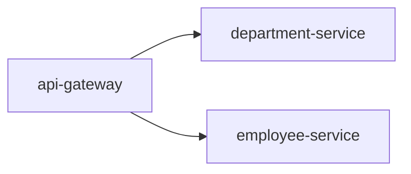

비즈니스 로직을 담고 있는 `department-service`, `employee-service` 에 대한 접근은 `api-gateway` 를 통해 이루어진다.

`org.springframework.cloud:spring-cloud-starter-gateway` 스프링이 제공하는 gateway 모듈을 사용한다.


클라이언트가 직접적으로 비즈니스 로직에 요청을 보내는 것이 아니라, gateway 에 요청을 보내면 매칭되는 서비스로 라우팅된다.


---

# 보안관련 메모

해당 프로젝트는 초초초간단 프로젝트이기 때문에 보안이 적용되어 있지 않다. 만약 OAuth2 를 통한 google, github 처럼 소셜 로그인을 한 뒤 Access Token 을 획득해야만 리소스 서버에 접근할 수 있다면 어떻게 해야할까?

좀 오래된 글이지만 체계적으로 정리가 잘 되어 있는 [참고](https://spring.io/blog/2019/08/16/securing-services-with-spring-cloud-gateway) 사이트를 통해 보안 적용 시 gateway 설정의 기초를 파악할 수 있다.

아래와 같이 oauth2 가 설정되어 있다고 가정하자. 인증, 인가 절차는 1회만 받으면 충분하므로 gateway 어플리케이션에 적용한다.

```yaml
security:
    oauth2:
      client:
        registration:
          gateway:
            provider: uaa
            client-id: gateway
            client-secret: secret
            authorization-grant-type: authorization_code
            redirect-uri-template: "{baseUrl}/login/oauth2/code/{registrationId}"
            scope: openid,profile,email,resource.read
        provider:
          uaa:
            authorization-uri: http://localhost:8090/uaa/oauth/authorize
            token-uri: http://uaa:8090/uaa/oauth/token
            user-info-uri: http://uaa:8090/uaa/userinfo
            user-name-attribute: sub
            jwk-set-uri: http://uaa:8090/uaa/token_keys
```

여타 모듈과 마찬가지로 Bean 으로 직접 등록할 수도 있고, 다른 설정 파일과 같은 결로 저장하고 싶다면 YAML 형식으로도 설정이 가능하다.

첫번째로, Bean 으로 등록하는 방법이다.
```java
@Autowired
private TokenRelayGatewayFilterFactory filterFactory;

@Bean
public RouteLocator customRouteLocator(RouteLocatorBuilder builder) {
    return builder.routes()
            .route("resource", r -> r.path("/resource")
              .filters(f -> f.filters(filterFactory.apply())
                .removeRequestHeader("Cookie"))
            .uri("http://resource:9000")) 
            .build();
}
```
마찬가지로 YAML 파일을 이용한 방법이다.

```yaml
spring:
  cloud:
    gateway:
      routes:
        - id: resource
          uri: http://resource:9000
          predicates:
            - Path=/resource
          filters:
            - TokenRelay=
            - RemoveRequestHeader=Cookie
```

위의 설정은 http://resource:9000 의 도메인으로 접근하는데, `/resource` 에 해당하는 uri 에 관한 설정이다. `/resource/**` 처럼 와일드카드도 사용할 수 있다. 그리고 알 수 있는 점은, uri 별로 세세하게 분류해서 인증, 인가 등의 작업을 할 수 있다는 점이다.

> Spring Security 와 동일하게 HTTP Request 가 컨트롤러로 전달되기 전에, 여러 filter 를 추가할 수 있다. 특히 보안관련해서 http header 에 특정 값을 지우거나, 추가하거나, 쿠키를 추가하거나, 지우는 등 다양한 옵션을 줄 수 있다.

설정이 잘 됐다면 컨트롤러는 어떻게 작성해야 할까?
컨트롤러 + 보안설정까지 세트로 살펴 봐야한다.

```java
// 1.
@GetMapping("/resource")
public String resource(@AuthenticationPrincipal Jwt jwt) {
    return String.format("Resource accessed by: %s (with subjectId: %s)" ,
            jwt.getClaims().get("user_name"),
            jwt.getSubject());
}

// 2.
public class SecurityConfig {

    @Bean
    SecurityWebFilterChain springSecurityFilterChain(ServerHttpSecurity http) throws Exception {
        http
            .authorizeExchange()
            .pathMatchers("/resource").hasAuthority("SCOPE_resource.read")
            .anyExchange().authenticated()
            .and()
            .oauth2ResourceServer()
            .jwt();
        return http.build();
    }
}

```

`ServerHttpSecurity` 임을 주의하자. 그리고 oauth2 가 적용되었고, 세션이 아닌 jwt 로 보안 정보를 주고 받겠다고 설정한다. 스프링 시큐리티 버전이 올라감에 따라 해당 설정은 수정이 필요하다.

마지막으로, gateway 를 거쳐서 요청을 처리할 서버에서 다음과 같은 설정이 필요하다.

```yaml
spring:
  security:
    oauth2:
      resourceserver:
        jwt:
          jwk-set-uri: http://uaa:8090/uaa/token_keys
```
keycloak, okta, 소셜 로그인 등을 사용한 단일 프로젝트라면 `jwt-set-uri` 는 해당 인가서버 주소가 들어가기 마련이다. 하지만 gateway 에서 access token 을 받기 위해 `jwt-set-uri` 주소를 gateway 로 잡는다.

스프링부트, 스프링시큐리티 모두 버전이 바뀌어 설정 방법이 약간씩 차이가 있을 수는 있으나

- [깃허브 주소](https://github.com/benwilcock/spring-cloud-gateway-demo/tree/master/security-gateway)
- [본문](https://spring.io/blog/2019/08/16/securing-services-with-spring-cloud-gateway)

에서 구체적인 설정을 확인할 수 있다.